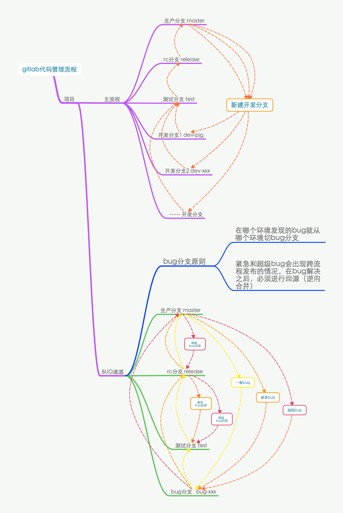

Git使用说明和分支管理规范
=======================
------ By Pang.J.G

[TOC]

## 一、安装 git 客户端
由于Git诞生自Linux项目管理的历史原因，决定了它更亲近于Linux或Mac的使用者，严重建议开发人员使用Git命令行来进行代码管理。
当然，如果您坚持要使用可视化的客户端，那也请自便。这只是一个建议。

### Windows
推荐安装带有命令行的客户端，推荐GitHub客户端+powershell。

### Mac, Linux 
系统自带 ，请坚持使用命令行。

## 二、初次运行 Git 前的配置

###1.Gitlab身份与开发机进行绑定（免密码提交）

#### STEP 1 : 生成本机密钥

在终端输入

> 终端： window用户请使用git客户端提供的命令行终端

```
ssh-keygen -t rsa -C "你的邮箱"
```
注： 一路回车即可,不要输密码,不然每次提交都要求你输密码

#### STEP 2 : 生成并复制公钥

```
cat ~/.ssh/id_rsa.pub
```
> Windows的用户可能需要注意，这一命令生成秘钥在复制后，粘贴可能会有分行的问题，需要删掉分行。

#### STEP 3 : 将公钥加入Gitlab库的可信任列表

打开 http://gitlab.shenmam.com/profile/keys ，点击 “Add SSH Key”

###2.完善本地代码库的用户信息（仅首次使用Git时需要）
完成了上述的配置后，在首次使用git提交代码之前，还要配置的是开发者的个人信息，包括git提交记录显示的用户名称和电子邮件地址。
```
//请根据自己的名字进行修改
$ git config --global user.name "庞锦贵”

//请根据自己的邮箱进行修改
$ git config --global user.email 100029@shenba.com
```
> 每次 Git 提交时都会引用这两条信息，说明是谁提交了更新，所以会随更新内容一起被永久纳入历史记录。

#### 延伸阅读：git config使用说明
git config是专门用来配置或读取Git相应的工作环境变量，正是由这些环境变量，决定了 Git 在各个环节的具体工作方式和行为。这些变量可以存放在以下三个不同的地方：

1. 系统中对所有用户都普遍适用的配置 /etc/gitconfig 文件（window在git的安装目录下）
> 用法： git config --system 命令读写的就是这个文件

2. 用户目录下的配置文件，即 ~/.gitconfig 文件（这是mac或linux，windows应该是在当前用户的配置文件夹中）
> 用法：git config --global 命令读写的就是这个文件

3. 当前项目的 git 目录中的配置文件（也就是工作目录中的 .git/config 文件），仅仅针对当前项目有效。

> 注意：每一个级别的配置都会覆盖上层的相同配置，所以 .git/config 里的配置会覆盖/etc/gitconfig 中的同名变量。


## 三、日常开发常用git操作说明

### 1. 克隆代码仓

```
git clone git@gitlab.shenmam.com:Qianduan/pcstatics.shenba.com.git
```
> 一般情况下，建议使用SSH协议来克隆项目代码，这样提交不需要反复询问用户密码，但前提是你必须完成“Gitlab身份与开发机进行绑定”。

### 2. 查看分支
通过命令行的方式新建分支，在新建之前需要确定你当前客隆回来本地的代码是处于哪个分支。
```
//查看本地分支情况
git branch
//查看所有分支
git branch -a
```

### 3. 切换分支
一般情况下，客隆回来的代码库默认是`master`分支（这个可以在gitlab上进行调整，需要管理员进行操作）。

当新建分支时，一般要从主分支（`master`分支）上派生出来，需要请先更换到`master`分支下。
```
//git checkout [分支名]，例如：
git checkout master
```

### 4. 派生并切换至新分支

当你确定本地分支已经切换至`master`分支，那么就可以从这个分支派生一条新的开发分支。
```
//派生一条名为‘pjg-dev’的新分支
git branch pjg-dev

//换到自己新建的开发分支
git checkout pjg-dev
```
派生后直接切换至新分支
```
git branch -b pjg-dev
```
即 `git branch` 带上 `-b` 参数就等于上面个两个命令。


### 5. 分支的日常常用操作

#### ① 添加文件或目录
```
//git add [-f] [文件/目录]，例如：
//把_src目录的改变加入代码库缓存区
git add _src/

//把首页js模块的改变加入代码库缓存区
git add _src/js/mods/index.js
```

#### ② 批量添加
```
// 这个方法只对在内容有修改的才有效，对删除或新增的文件无效
git add .
// 提交所有改变，包括新增或删除，一下两则命令是等效的
git add --all
git add -A
```

#### ③ 提交代码到本地仓库
```
git commit -m '提交说明'
```

#### ④ 查看几次commit的区别
```
git diff
```

#### ⑤ 查看commit记录或状态
```
git status
```

### 6. 分支推送、管理的常用操作

#### ① 将branch push到远程
```
git push origin pjg-dev

```
#### ② 查看分支情况
```
// 查看远程分支
git branch -r

// 查看本地和远程分支
git branch -a
// or
git branch --all
```

#### ③ 删除远程分支
```
git push origin --delete pjg-dev
```


### 7. 分支更新、合并的常用操作

#### ① 从服务器更新代码
```
git pull
```
> 这则命令一般用于更新远程代码库的状态（主要更新存在pull记录的本地分支的代码状态），如果你所处分支没有代码修改记录，而且别人也没有修改过你的分支，那么这则命令是不会产生当前分支的代码修改的。


#### ② 将其他分支代码更新到当前分支
```
// 将 ccw-dev 分支的远程代码更新到 pjg-dev(这是开发者所处的分支)
git pull origin ccw-dev
```

**git pull origin 用途说明**

- **用途1：同步其他开发分支。**
比如：
两个人要开发同一个功能，但两人又没有约定到同一分支下进行开发，那么，这个命令可以用于两条分支的代码同步。

- **用途2：用于代码的合并。**
比如：
开发完成后，开发将当前开发分支提交到代码库后，进入test环节，那么可以这么操作：
```
git checkout test  //切换到test分支
git pull  // 更新test的状态
git pull origin pjg-dev  //同步服务端的pjg-dev分支到当前分支，即test分支
git push // 推送同步的结果到远程仓库
```

> 如果本地文件有修改，请先 **git commit -m**, 再 **git pull** !!!  紧记!!! 
> 包括 **更换分支，新建分支** 等操作，请先 **git commit** !

#### ③ 合并分支
`git pull origin`可以完成合并，其实分支合并`git merge`才是正宗的命令，用法如下：
```
git merge [要合并的分支]
```

实际操作案例：
```
git checkout test //先更换到目标分支，如测试
git pull  // 更新test的状态
git merge origin/pjg-dev  //合并服务端的pjg-dev分支到当前分支，即test分支
git push // 推送同步的结果到远程仓库
```
> `git merge pjg-dev` 则是合并本地pjg-dev分支，即把本地的pjg-dev分支合并到本地的test分支。

### 8. 合并冲突处理
不管用`git pull origin`还是用`git merge`来合并分支，在合并过程中都可能产生冲突，git会进行自动 merge 分析来解决冲突，但很多时候冲突无法避免，那么就要开发人员手工处理冲突。

一般步骤如下：

- STEP1: 合并分支；
- STEP2: 冲突产生，git自动判断自动merge一次，冲突无法自动解决，需要人工干预；
- STEP3: 合并者根据冲突的错误提示，找到冲突的文件（一般是搜索 `>>>>` 或 `<<<<` ）；
- STEP4: 根据冲突文件的提示，找到导致冲突的其他开发人员，协商修改冲突文件的代码；
- STEP5: 冲突的文件修改完成后，执行如下命令：
```
git add -f 冲突文件
// or
git add --all
git commit -m 'fix冲突'
git push // 推送同步的结果到远程仓库
```
### 9. 其他git常用命令

#### 回滚，重置
当本地分支出现情况， 可重置到特定版本号
```
git reset --hard [版本号]
```

#### 查看日志
```
git log --stat
```

#### 放弃修改切换至其他分支
```
git checkout test -f
```
> 注意，这是强制切换到其他分支，如果本地的修改没有被commit，则会丢失文件的修改记录，切记。


### 10. Git tag应用标签使用说明

#### 新建标签
git tag –a -m 如果是需要给某个历史提交节点打标签，则加上对应hashcode即可
```
git tag v2.2
git tag -a v2.2 -m "Release version v2.2"
```

#### 查看标签
语法： git tag –l <name> ， <name>支持通配符
```
//查看某个tag
git tag -l v2.2

//列出所有的tag名称
git tag -l

//查看某个tag的详情(有问题)
git tag -v v2.2
```

#### 把新建的tag push到远程
```
git push origin v2.2
git push origin –tags # 将本地所有标签一次性提交到git服务器
```

> 值得注意的是，如果tag名字和分支名字一样的时候，push需要指定refs的详细路径，因为分支和tag在git内部是这样表示的（只是引用），tag只存储所指向的那一次提交：
```
refs/tags/{tagnane} refs/heads/branches/{branchnane}
```
所以要这样push相同名字的tag和分支
```
git push origin refs/tags/product 
git push origin refs/heads/branches/product
```

#### 删除标签
```
//删除本地tag v2.2
git tag -d v2.2

//删除远程tag
git push origin :v2.2
```

#### 恢复代码到某个标签点
```
git show v2.2 # 由此得到对应的提交哈希值，然后git reset 回退代码
git reset --hard [版本号]
```

## 四、Git分支管理规范

### 1.分支的命名规范

|主分支|说明
|:--|:-
|master|生产分支
|release|rc分支
|test|test分支
|dev|开发暂存分支
|*-dev|本地开发分支
|*-bug|修复bug分支
|*-fix|功能补丁分支

**说明**
- 本地开发统一采用 `dev` 作为标识符，比如 `pjg1-dev` 、`pjg2-dev`
- 除了`bug`和`fix`是维护和热补丁分支前缀，具体的分支名应当要简短且富有描述性。一般情况下，建议以禅道的bugID来命名，便于bug跟踪。
- 比如:  `pjg-id2101-bug`表示由pjg解决或跟进的ID为2101的bug，依此类推。

### 2.新建分支原则

#### 原则1：
新建的开发分支原则上不能包含还在测试中的功能，因此开发人员应当从 master 派生分支来进行开发。

#### 原则2：
一个需求一个分支，不要混淆。同一个开发者允许派生多个开发分支，以应对不同功能需求的开发。

> 请注意，开发者请不要为了方便，而把不同的功能或需求都在同一个分支下进行开发，这样会造成多个功能混合在一起发布，这会给测试环节带来很多不便，以及问题回滚也很困难。
> 当然，如果你确信自己对git超级精通，可以无视这个原则。

### 3. 分支合并及派生流程

如下图所示。



## THE END.