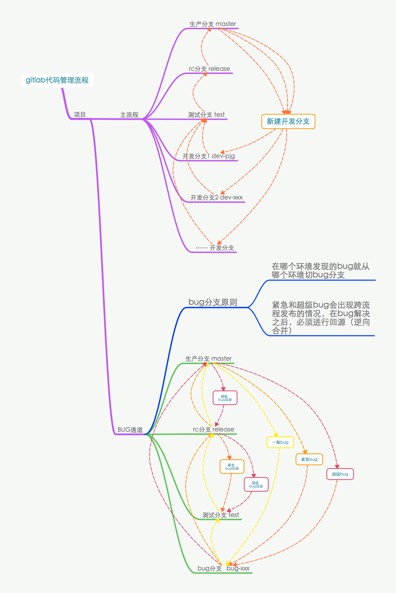

# Git分支管理规范

## 分支的命名规范

|主分支|说明|
|:-------|:------|
|master|生产分支|
|release|rc分支|
|test|test分支|
|dev|开发暂存分支|
|dev-*|本地开发分支|
|bug-*|修复bug分支|
|fix-*|功能补丁分支|

**说明**
- 本地开发统一采用 `dev-` 作为标识符，比如 `dev-pjg1` 、`dev-pjg2`
- 在本规范发布前，原来大多数同事采用 `xxx-dev`，2.0版本以后迭代请将标识符前置，便于在 `gitlab` 中对分支排序管理，查找也方便
- `bug-`和`fix-`是维护和热补丁分支前缀，具体的分支名应当要简短且富有描述性。一般情况下，建议以禅道的bugID来命名，便于bug跟踪。
- 比如:  `bug-id2101-pjg`表示ID为2101的bug，由pjg解决或跟进的bug。

## 分支的新建和合并流程

新建的开发分支原则上不能包含还在测试中的功能，因此开发人员应当从 master 切分支来进行开发。

**bug分支原则:**

- 在哪个环境发现的bug就从哪个环境切bug分支
- 紧急和超级bug会出现跨流程发布的情况，在bug解决之后，必须进行回源（逆向合并）

