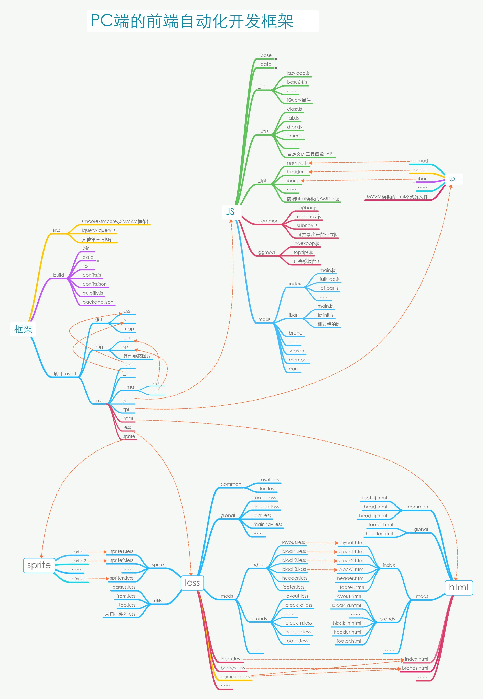
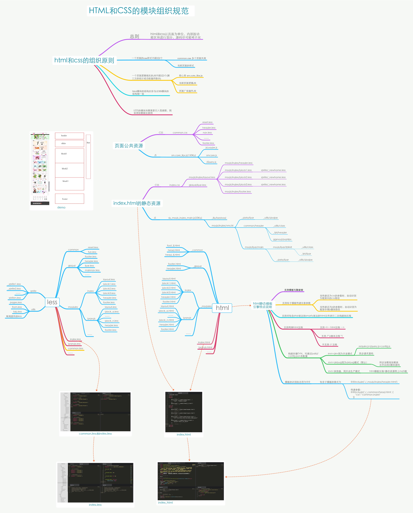
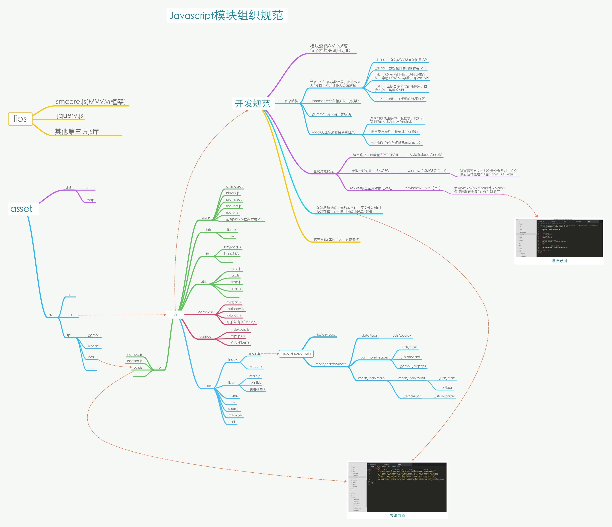

# 前端自动化开发框架和部署说明

a front-end automation construction framework based on gulpJS.
--------------------------
by Pang.J.G


## 安装 nodeJS 环境

本项目基于nodejs环境下的Gulp.JS。

* 前往 [http://nodejs.org/](http://nodejs.org/) 安装nodeJS
   - 注意系统是32位还是64位的，选择对应的版本
   - 如果是windows系统，需自行设置好环境变量，将nodejs的路径加入到系统的 `path` 环境变量中

* 安装 `gulp` 全局支持，在终端执行 `npm install -g gulp`

## 项目部署和初始化

本代码库包含了一个静态demo，如在实际开发的项目中部署？例如，你打算将前端静态资源放在 `~/statics/` 文件夹，那么：

#### STEP 1：复制源码

将 `build` 目录下的源码复制到 `statics` 文件夹下；

如果，单独对源码进行代码管理，可以使用以下命令：

```
git clone https://github.com/lmtdit/bdCore.git build
```

#### STEP 2：安装依赖

进入build目录，执行 `npm install`，安装依赖的nodejs模块

#### STEP 3：初始化

模块安装完成后，使用如下命令进行初始化

```
gulp init
```

#### STEP 4：目录结构

项目初始化后，会根据 `build/config.json` 中的配置生成如下的目录结构：

```js
├── build
    ├── bin // shell执行命令目录
    ├── data // 第三方JS模块目录
    ├── lib // 核心的构建方法 
    ├── config.js // 开发配置文件
    ├── config.json // 项目构建的配置入口文件
    ├── gulpfile.js // gulp启动配置入口文件
    └── package.json // nodeJS依赖安装的包管理文件
├──_src //静态源码目录，原则上，这个目录中的所有资源是不需要发布到预发布及生产环境的
    ├──_css //本地debug的缓存目录
    ├──_js //本地debug的缓存目录
    ├──_img //本地debug的缓存目录
    ├──html //后端html模板的构建目录，支持后端模板引擎语言，如smarty
    ├──js //js源码，AMD模块规范
    ├──less //CSS的less源码目录
    ├──sprite //雪碧图的源码目录
    └──tpl //前端MVVM引擎的模板源码目录，开发维护的是html，但生产时会被封装成ADM规范的js模块
├── asset //前端资源的生产目录，根据config.json的配置来定
    ├──css  //带hash的css文件，保存压缩版和源码版两个版本
    ├──js  //带hash的css文件，保存压缩版和源码版两个版本
    ├──img //图片资源目录
    ├   ├──bg //css中用到的单个背景图的hash格式输出目录，自动构建
    ├   └──sp //css中用到的雪碧图的hash格式输出目录，自动构建
    └──map  //保存css、js以及雪碧图的hash的map
```

> 如果 `build/config.json` 文件不存在，则初始化过程会自动生成，默认配置的源文件是 `build/data/default.json`。

#### STEP 5：前后端解耦

[为何要解耦？如何解耦？](./关于前后端解耦的思考与实现.md)

构建框架则会根据 `build/config.json` 中的设置，将map文件生成到 `{{distPathName}}/map` 目录中，即默认的map源码路径为 `assets/map` ，文件分别是
```
cssbgmap.json // css中背景图片资源map，或则js中用到的图片资源map
cssmap.json // css生产文件的map
jsLibs.json // js生产文件的map
jsmap.json // js源文件的map
```

## 开发

ok，上述的事项已经部署完成，那么我们可以进入前端的项目开了。使用 `gulp` 命令默认启动开发模式：

```
gulp
```

#### 更多参数使用说明

以gulp命令启动程序，它可接收两个参数，分别是

参数1： --env 或者 --e
> 此参数是环境参数，默认值为'local'，其他值分别为test、rc、www，分别针对测试、预发布和生产环境，在测试和发布环节中使用。

参数2： --debug 或者 --d
> 此参数为调试开关，带上此参数，html模板则开启debug模式

**命令使用示例:**
1、local开发环境的watch命令：
```shell
gulp

# or
gulp --e local

# or
gulp --env local
#以上三个命令是等效的
```

2、local开发环境的debug命令：
```shell
gulp --d

# or
gulp --debug

# or
gulp --env local --d
```

3、发布代码
```
# 测试环境
gulp --e test
gulp --env test

# 预发布环境
gulp --e rc
gulp --env rc

# 生产环境
gulp --e rc
gulp --env rc
```

4、其他命令使用说明

**查看自动化框架支持的项目构建命令**
```
gulp -T
gulp helper
```

本前端开发框架还支持如下命令：
```js
 Tasks
   ├── init //用于前端项目的初始化
   ├── del.data //删除构建过程的缓存数据
   ├── del.dist //清理自动构建的静态文件[生产文件]
   ├── jslibs //生产js的第三方库列表，主要用于构建require.config的paths对象
   ├── cfg //生成require.config
   ├── tpl //将html模板构建成为JS模块，即html转化为AMD规范的js文件
   ├── js2dev //匿名的AMD模块构建为具名的AMD模块，并发布到源码的缓存目录[_src/_js/]，供本地调用
   ├── js2dist //按AMD规范的js模块转化为原生的js，并按依赖顺序COMBO成1个文件，然后发布到生产目录，生成2份代码
   ├── sp //合并生产雪碧图和对应了LESS
   ├── bgmap //所有css将用到背景图[包括自动生产的雪碧]生产一份hash map（json文件）
   ├── less //将less输出为css，并发布到源码的缓存目录[_src/_css/]，供本地调用
   ├── css //将缓存目录中的css压缩并自动将引用背景图加上MD5戳，然后发布到生产目录
   ├── all2dist //css和js源码的缓存目录中的文件发布到生产目录
   ├── html //将模块化的静态html文件构建成一个静态可使用的html demo（img scr的引用图片替换为带MD5戳）
   ├── watch //gulp的watch任务，可快速启动开发者模式
   ├── default //默认任务，默认进入开发模式
   └── release //发布任务
```

## 规范和建议

### 编程规范

- [JavaScript编程规范](./build/javascript.md)

- [CSS编程规范](./build/javascript.md)

### 架构流程和目录规范






