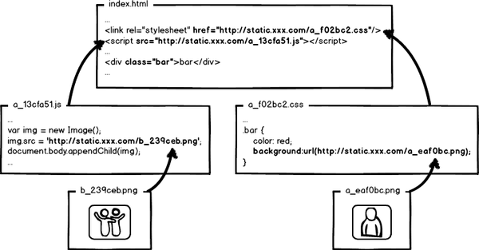
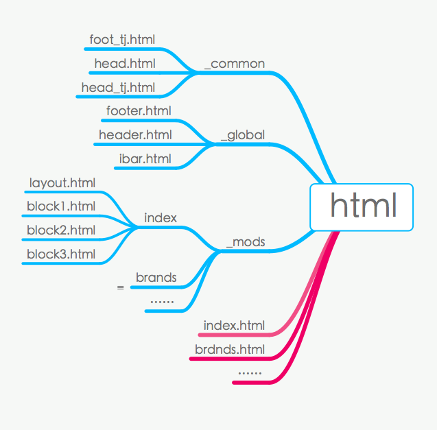
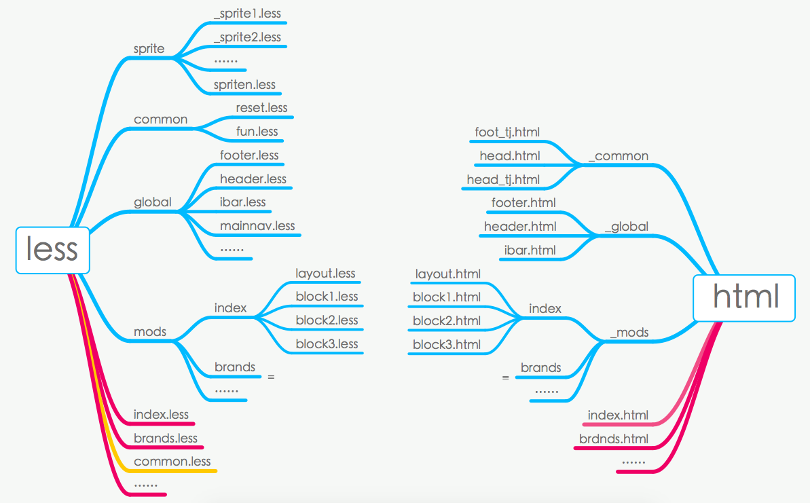

# 关于前端优化引起的前后端解耦问题的思考与实现

------------------
by Pang.J.G

在电商项目的开发中，前后端协作分离开发是非常必要的。为保障在项目上线后能快速迭代，前端和后端应该要做到尽可能地减少沟通和协同开发的成本，特别是前后端的交集部分——服务端的模板层，应该职责分明，而且要和业务代码做好隔离。

但是，理想是丰满的，现实却是很骨感。

## 前端代码优化后带来的资源定位问题

在一个成熟的前端静态资源优化方案中，基本上实现了以下的代码优化要求：

- 优化网络请求 - 静态资源CDN部署，分域多域部署；
- 提高性能，节省带宽 - 配置超长时间的本地缓存；
- 精确的缓存和版本控制 - 采用内容摘要作为缓存更新依据，即文件的MD5值；
- 可灰度发布，平滑升级 - 更新资源发布路径实现非覆盖式发布。

然而，在项目的快速迭代中，完成上诉的需求势必会导致静态资源的实际路径的频繁变化，分析其原因主要有以下几点：

1，html、css或js的内容有修改，内容摘要发生了变化，MD5值一定是变化了的，那么，发布生产后资源的引用路径一定发生变化，这是最直接的内容变化导致的路劲变化；

2，html、CSS和JS中引用的外部资源，主要是引用图片的变化，包括css中引用的背景图片和js引用到的图片发生了改变，这些引用资源也是要随同其他静态资源一并发布到CDN，强缓存机制就要求在html、CSS和JS的内容中体现出来，引用资源的摘要信息也会引起引用文件本身的内容改变，从而形成级联的摘要变化；



3，在不同的环境中，静态资源的域名路径可能是变化的，如同一张图片在不同的CDN服务器上对应的CDN域名是不一样的，而且不同的环节也可能是不一样。
比如，名为`bg_index.jpg`的图片
在测试环节是
```
http://test.aaa.com/img/bg_index.jpg
http://rc.aaa.com/img/bg_index.jpg
```
在生产环节是
```
http://cnd1.aaa.com/img/bg_index.jpg
http://cnd2.aaa.com/img/bg_index.jpg
...
http://cndn.aaa.com/img/bg_index.jpg
```
这些引用路劲的不同，同样也会导致静态文件本身内容摘要的改变，进而使得页面中文件路径发生变化。

那么，在这种情况下，如何解决服务端模板层上将要引用到的静态资源的定位问题呢？

## 不同的项目，不同的团队，不同的方案

解决这个问题，这个需要基于项目的实际情况，分两个方面进行分析：

### 如果后端维护模板

首先，为何要根据团队能力模型的定方案？

其实很简单，模板层较为复杂，如果前端团队整体能力相对较弱，无法有效维护服务端的模板层，大多数时候只能由后端来维护这一层代码了。

但事实上，服务端模板要引用前端静态资源，而前端哪怕只是修改了一个字符，最终的静态文件路径都是不同的，手工维护静态文件的引用是不现实的，因此需要一个机制来解决此问题。

那么，只有通过在静态资源构建过程中，动态地生成一份资源引用的map，通过这份map来定位资源。

不过，如果采用生成Map的方案，会延伸出一些新的而且必须解决的问题：

#### 问题1 ：静态资源解析的机制该由谁设计？

但是，问题又来了！谁来设计静态资源解析的机制呢？后端工程师？还是前端工程师？
最适合的角色其实是前端开发架构的设计者。

因为这一机制除了要解决资源定位问题，还要解决开发、debug的体验问题。这指的是，这个机制要既要方便前端开发的同时，也要方便开发人员进行错误排查，特别是在本地开发和测试环节，设计上要考虑预留一些debug调试接口。

对于怎样才让前端开发更方便，debug也更容易？当然，后端开发人员更多是关心后端的业务逻辑，只有前端自己才最关心这些问题。

站在这一角度，前端架构师也要熟悉甚至精通后端语言。

#### 问题2 ：map放在哪里？是最新的吗？版本如何管理？

要知道，静态资源的最新map肯定是在优化和构建静态资源的过程中产生，也就是它是在前端开发环境下生成的，但是这份map又要被后端语言来解析，如果放在静态服务器中，用户访问构建资源路径时，还就得让服务器到CDN服务器上拿这份map吗？

如果CDN与业务服务器通讯出问题怎么办？

很显然，这样做是不合理的。因此，这份map应当随同模板层一起放置在服务端，无须跨域，访问速度也快。

但是，这就要求前端开发要有后端开发环境，控制map的合并及迭代，但如果后端修改了业务逻辑或模板有修改，怎么知道新的业务所需的静态资源map是匹配的呢？而且后端同事更新合并最新的代码库时，会碰上map文件冲突，怎么办？

在实际开发中，每次发新版，后端可能都要问前端，“你的静态资源map是不是最新的”，“你改的东西都上了没有”，等等。。。如果后端修改了模板，要发新版之前就要经过前端的确认与同意，他们一定很不爽。

是的，前后端因为map文件，又紧密地耦合在一起了。

烦不烦？那么，有没有彻底解耦的解决方案呢？

这个问题先放一放。思考一下，如果由前端来维护模板的情况又是怎样的？

### 前端维护服务端模板

按照项目的前后端开发机制，View层模板分为服务端模板和客户端模板。虽然，不管谁来维护模板层，都要解决静态资源的动态引用问题，前端维护也一样的。

但是，如果由前端来维护页面view层，那么是不是非要通过map来解决？

#### 谁说服务端的模板就一定是手工维护的呢？

对于前端而言，哪一端的模板其实都是一样的。

现阶段，前端开发者应当要具备良好的工程化意识。既然css、js的优化可以通过动态构建的方式来压缩优化，CSS有LESS预处理，JS也有CoffeeScript的预处理，对吧？那么，我们要意识到，不管客服端抑或是服务端模板，也是可以通过动态构建的方式生成，并不一定是手工维护的，不是吗？

职责原因，后端开发者对于View层的优化思考是有限的，而且也不太可能要求他们安装前端的代码优化构建环境，基于Map的动态解析方案也只是一个折中方案，站在前端优化的角度而言，这并非最优化的。

**我认为，一个现代化、工程化的项目，任何由前端产出的并用于生产的资源，都应当是通过构建的方式产生的。**

但是这和服务端模板由前端维护有啥关系呢？

ok，我们对于css和js的模块化已经比较了解和容易接受了，但对于html模块化，可能更多停留在服务端动态语言的范畴。其实，html的开发在静态开发阶段也要模块化。

#### 静态html的模块化机制

一般来说，电商属于中大型WEB项目，页面数量往往比较多，而且随着项目运营的变化，可能每个页面都要做各种细节优化调整。尽管如此，整个项目肯定有很多公共的东西，比如头尾部，各种组件，是可以抽离成公共模块。

但在前端开发静态demo的过程中，缺少后端语言环境，无法通过语言环境的方式将公共的部分抽象化。因此，很多项目中前端要开发一份新的页面，可能是这样做的：

先复制之前有相同部分的demo，剔除不同的部分后，再增加自己的html和样式，页面需求越多，就反复执行这样的操作。但是，如果公共的部分变化了呢？前端可能要修改所有静态demo，这就头痛了。

如果静态demo要实施模块开发，该如何做呢？

以聚美为例，如图所示，分为
|区块|说明
|:---|:---
|header|公共头部，会被很多页面复用
|slider|轮播广告，首页私有
|block1|区块1，当前页面私有，也可在列表页专题页面中用到
|block2|区块2，当前页面私有，也可在列表页专题页面中用到
|block3|区块3，当前页面私有，也可在列表页专题页面中用到
|footer|公共脚部，会被很多页面复用
|ibar|侧边栏，全局的设计，会被很多页面复用


而静态html模块目录架构是这样的：



`index.html`内容如下
```html
<!DOCTYPE html>
<html lang="en">
<head>
@@include("./_global/head.html",{
    "title":"首页",
    "css_head":"common,index"
})
</head>
<body>
@@include("./_global/header.html")
<!-- 引入主区块文件 -->
@@include("./_mods/index/layout.html")
<!-- 引入footer 文件 -->
@@include("./_global/footer.html")
@@include("./_global/ibar.html")
</body>
</html>
```

`./_mods/index/layout.html`的内容如下：
```html
@@include("./block1.html")
@@include("./block2.html")
@@include("./block3.html")
```

`./_global/head.html`的内容如下：
```html
<meta charset="utf-8">
<meta http-equiv="X-UA-Compatible" content="IE=edge">
<meta name="viewport" content="width=device-width, initial-scale=1.0" />
<meta name="description" content="@@title" />
<meta name="author" content="@@title" />
<title>@@title</title>
@@css_head
```
index.html文件作为主模板来生成最终的静态demo，在这个过程中通过模板引擎向子模板传递参数，当需要构建不同的页面时，传递不同的参数，例如：
```
@@include("./_global/head.html",{
    "title":"首页",
    "css_head":"common,index"
})
```
传递title和css样式，通过构建的方式生成最终的静态demo，在构建过程中，结合map文件将静态CSS资源插入到demo文件中，从而解决内容摘要变化，导致的css文件路径变化的问题。

同样的，服务端模板如果也是由前端来维护，那么这一机制是可以复用到服务端模板上的。

当然，在样式的书写上，也建议以html模块的划分来规划其源码的目录及文件结构，以便后期的维护与扩展。




### 前后端解耦的建议

基于上述的分析，前后端解耦的一些建议：

#### 最优方案：纯静态的构建方案，不考虑SEO

将静态的demo构建机制作为后端模板的构建机制，直接在开发过程中解决资源的定位问题，并对html模板进行压缩优化。如果前端团队的能力模型符合这样的要求，建议采用这一方式。这种方式非常适合于移动端页面的开发。

**优点：**

+ 前端性能优化可以做到极致，前后端可以做到完全解耦。

**缺点：**

+ 如果是全部客户端模板，SEO优化问题就无法有效解决。
+ 可通过nodejs加中间件，来处理SEO问题，但对前端开发人员的要求较高，人才成本偏高。
+ 前端框架中需要增加一个模板构建方案，底层构建方案的开发工作较多。


#### 次优方案：服务端模板，但由前端来维护

这个要在服务端架构的初期，后端架构师要意识到将模板层从后端的逻辑代码中抽离出来，单独进行版本管理，否则前后端的耦合就可能是一个无解的问题。假设服务端模板层已经独立于逻辑代码，单独管理了，那么建议由前端来维护这些文件，这是可以做到接近最优化。

**优点：**

+ SEO优化问题很容易解决；
+ 页面的性能也很好，前端资源的引用也可以通过静态构建的方式解决，前后端完全解耦。

**缺点：**

+ 前端开发人员的要求需要具备一定服务端的语言能力；
+ 即便是模板层也是要依赖于后端环境的，虽然是相对简单的开发环境，前端开发人员还需要部署后端环境；
+ 前端框架中需要增加一个模板构建方案，底层构建方案的开发工作较多。

#### 现实方案：基于map的解决方案

如果模板要共同维护的，或者后端来维护的，那么基于map的方案是最现实的选择。
但在后端模板层的部署上，也最好是要将服务端模板层从逻辑代码中抽离出来，单独进行版本控制，前后端尽可能地解耦。而且，map的文件格式应当与服务端语言一致，而且存放在模板层的同一代码仓库中，便于版本统一管理、迭代以及回滚。

**优点：**

+ SEO优化问题很容易解决；
+ 可以在现有的项目上实施，不需要太多的后端架构调整，部署起来比较容易；
+ 前后端也可以做到开发基本分离，可以在已上线的项目中推进前端的工程化。

**缺点：**
+ 前后端无法完全解耦，这是最大的问题；
+ 模板层要依赖于后端环境的，如果由前端开发人员维护，则需要前端部署后端开发环境；
+ 如果只是由后端维护，那么前端的一些性能优化方案就不是很方便，沟通成本高，势必影响迭代的速度；
+ 性能有一定牺牲，毕竟不是直接插入静态资源，而是通过解析map间接的方式插入，需要消耗一定的服务器运算时间。


## 一个基于php的静态资源解析实现

以下是一个基于php的静态资源解析实现(仅供参考)：

### js的map解析实现

```php
/**
 * init_js - 构造前端页面js资源请求的函数
 * @author  pjg
 * @param [string] $js_names 传入需要加载的js名称,不能为空,多个js用半角逗号“,”隔开
 * @param [string] $CURRENT_Environment 当前的环境，默认是'pc'，即静态域名为 PCSTATICS_SITE_URL
 *         ,如果值为'bc',则为BCSTATICS_SITE_URL
 * @return  string
 * @example 
 * <?php echo init_js('sb.corelibs.js,sb.mods_index.js,sb.mods_list.js,piwik.js');?>
 * 当在local开发环境下，默认启动require+jquery来调试源码，同时提供在URL加上 ‘dev=2’ 的参数时，则可以开启生产代码的调试
 * 当在test、rc以及生产环境下，在URL上加上 ‘dev=1’ 的参数时，则可以开启源码调试模式，以便错误的排查
 * 出于安全方面的考虑，在生产环境上不建议采用这样容易被猜测的URL参数来实现，切记。
 * 
 */
function init_js($js_names,$CURRENT_Environment='pc'){
    $jslink = '';
    // 调试开关 dev=1
    $_is_debug = $_GET['dev']==1 ? true : false;
    $_is_local = CURRENT_DOMAIN != 'test.' && CURRENT_DOMAIN != 'rc.' && CURRENT_DOMAIN != '';
    // 判断当前静态环境
    $static_path = ($CURRENT_Environment=='bc' ? BCSTATICS_SITE_URL : PCSTATICS_SITE_URL);
    $static_path .= (($_is_debug||$_is_local)&&$_GET['dev']!=2) ? '/_src' : '/assets';
    $js_path = $static_path . ((($_is_debug||$_is_local)&&$_GET['dev']!=2) ? '/_js/' : '/js/');
    // 处理请求
    $_tempArr = explode(",",$js_names);
    $map_path = BASE_TEMPlATES_ROOT_PATH .'/map/'.$CURRENT_Environment; // 构造map的资源路径
    $jsmap = require_once($map_path.'/jslibs.php');
    foreach ($_tempArr as $key => $value) {
        // 如果是本地，并且URL参数dev=2，那么可以直接调试生产码
        if(($_is_debug||$_is_local)&&$_GET['dev']!=2){
            // 调试模式
            if($value=='sb.corelibs.js'){
                $jslink .= '<script>var STATIC_PATH="'.$static_path.'",VARS=window.VARS={},_VM_=window._VM_={};</script>';
                $jslink .= '<script src="'.$js_path.'vendor/require/require.js"></script>' . "\n";
                $jslink .= '<script src="'.$js_path.'vendor/jquery/jquery.js"></script>' . "\n";
                $jslink .= '<script src="'.$js_path.'require_cfg.js?t='.time().'"></script>';
            }else{
                if(strpos($value,'sb.')===0){
                    $jsmod_name = str_replace('_','/',str_replace('.js','',str_replace('sb.','',$value)));
                    $jslink .= '<script>require(["' . $jsmod_name . '"])</script>';
                }else{
                    $jslink .= '<script src="'.$js_path.$value.'?t='.time().'"></script>';
                }
            }
        }else{
            // 生产模式
            $js_name = $value;
            $_id = str_replace('.js','',str_replace('sb.','',$value));
            if(array_key_exists($value,$jsmap)){
                $js_name = $jsmap[$value]['distname'];
            }else{
                $js_name = $value.'?t='.date("Ymdhi");
            }
            if($value=='sb.corelibs.js'){
                $jslink .= '<script>var STATIC_PATH="'.$static_path.'",VARS=window.VARS={},_VM_=window._VM_={};</script>';
            }
            $jslink .= '<script src="'.$js_path.$js_name.'" id="'.$_id.'"></script>';
        }
    }
    return $jslink;
}

```

### css的map解析实现

```php
/**
 * init_css - 构造前端页面css资源请求的函数
 * @author pjg
 * @param [string] $css_names  传入需要加载的css名称,不能为空,多个css用半角逗号“,”隔开
 * @param [string] $CURRENT_Environment 当前的环境，默认是'pc'，即静态域名为 PCSTATICS_SITE_URL
 *         ,如果值为'bc',则为BCSTATICS_SITE_URL
 * @return [string]
 * @example 
 * <?php echo init_css('common.css,index.css,test.css','pc');?>
 */
function init_css($css_names,$CURRENT_Environment='pc'){
    $csslink = '';
    // 调试开关 dev=1
    $_is_debug = $_GET['dev']==1 ? true : false;
    $_is_local = CURRENT_DOMAIN != 'test.' && CURRENT_DOMAIN != 'rc.' && CURRENT_DOMAIN != '';
    // 判断当前静态环境
    $static_path = ($CURRENT_Environment=='bc' ? BCSTATICS_SITE_URL : PCSTATICS_SITE_URL);
    $static_path .= (($_is_debug||$_is_local)&&$_GET['dev']!=2) ? '/_src/_css/' : '/assets/css/';
    // 处理请求
    $map_path = BASE_TEMPlATES_ROOT_PATH .'/map/'.$CURRENT_Environment; // 构造map的资源路径
    $cssmap = require_once($map_path.'/cssmap.php');
    $_tempArr = explode(",",$css_names);
    foreach ($_tempArr as $key => $value) {
        $css_name = $value;
        if(($_is_debug||$_is_local)&&$_GET['dev']!=2){
            // 调试模式
            $css_name = $value.'?t='.time();
        }else{
            // 生产模式
            if(array_key_exists($value,$cssmap)){
                $css_name = $cssmap[$value]['distname'];
            }else{
                $css_name = $value.'?t='.date("Ymdhi");
            }
        }
        $csslink .= '<link href="' . $static_path . $css_name . '" rel="stylesheet" type="text/css">';
    }
    return $csslink;
}
```